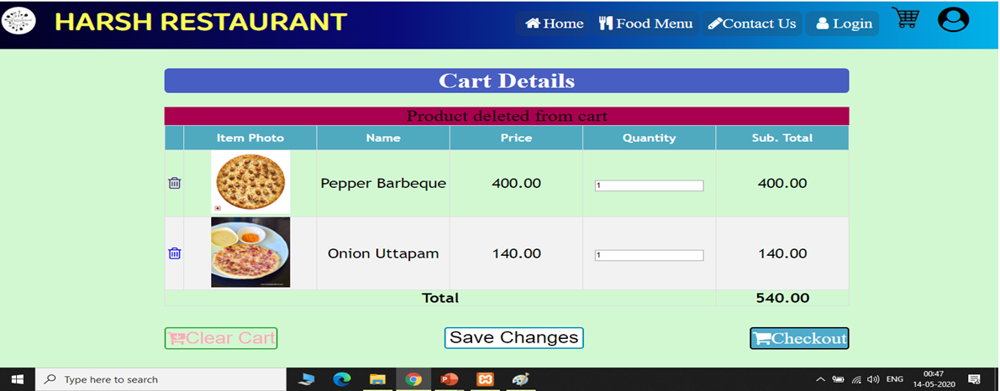

# Online Restaurant Application

#### Online Restaurant system will be used for ordering food from restaurant or food co-operative through a web page.
[](https://github.com/harshmgr/E-Restaurant) [](https://github.com/harshmgr/E-Restaruant/blob/master/LICENSE/)

## Abstract


E-Restaurant System will be used for ordering food from a 
restaurant or food co-operative through a web page. Much like ordering 
consumer goods online, many of these allow customers to keep accounts with 
them in order to make frequent ordering convenient. 
A customer will select the favorite food item usually filtered via type of 
cuisine and choose from available items and choose delivery or pick-up after 
the successful transaction.


[](https://github.com/harshmgr/E-Restaurant/blob/master/Restaurant%20Management%20System.pptx)

> **To download the presentation, [click here](https://github.com/harshmgr/E-Restaurant/blob/master/Restaurant%20Management%20System.pptx).**

> **You can check the screenshots of User Interface**




## Core Features


## Need help?

```java

  if (needHelp === true) {
     String emailId = "kumarharsh8549@gmail.com";
     // email is the best way to reach out to me.
     sendEmail(emailId);
  }

```

Feel free to contact me via [Facebook](https://www.facebook.com/harsh.arya.mgr/).

Invite me to connect on [LinkedIn](https://www.linkedin.com/in/harshkumar001/).

[](https://m.facebook.com/harsh.arya.mgr) [](https://www.linkedin.com/in/harshkumar001/)

## License

[](https://github.com/harshmgr/E-Restaurant/LICENSE) [](https://github.com/harshmgr)

**Apache &copy; [HARSH KUMAR](https://github.com/harshmgr/E-Restaurant/LICENSE)**

Thank you for being here!

Give Feedback on my Mail.

[](https://github.com/harshmgr)

------

```java

if(isAwesome){
        // thanks in advance :p
        starThisRepository();
        }

```

-------
